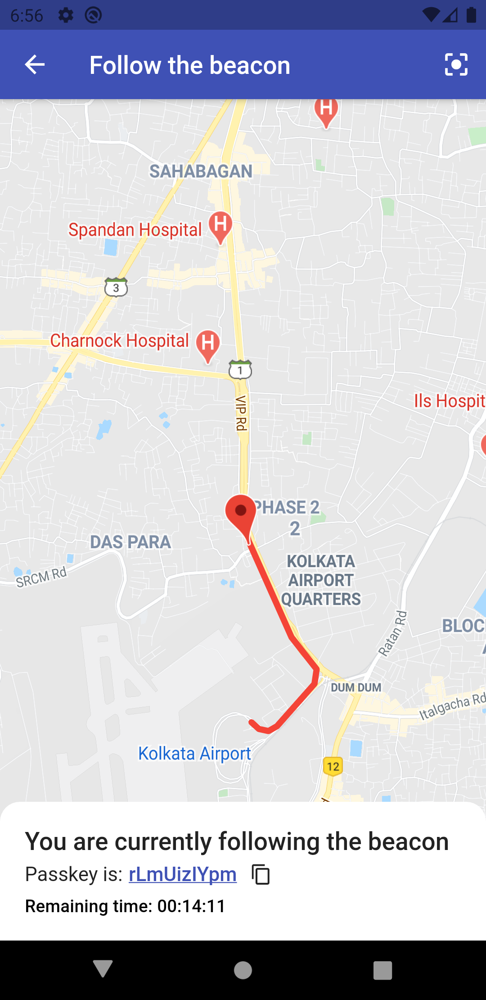

# Beacon-Flutter

A Flutter Application that is able to share your location with anyone who has a specific passkey.

## Overview

Suppose you are going to start a hike with friends and you want them to know your location but only for a certain duration (let say for 3 hours). You can do that just by creating a random passkey and your friends can track your location with that passkey.

Some screenshots are -

<table><tr>
<td style="text-align: center">

</td>
<td style="text-align: center">

</td>
</tr></table>

## Video demo

For demo video about how it works, click [here](https://drive.google.com/file/d/1J6u-EiEpsJRB1IzBJZgW7TO5RWWPPUAU/view?usp=sharing)

## Getting Started

For help getting started with Flutter, view our
[online documentation](https://flutter.dev/docs), which offers tutorials,
samples, guidance on mobile development, and a full API reference.
